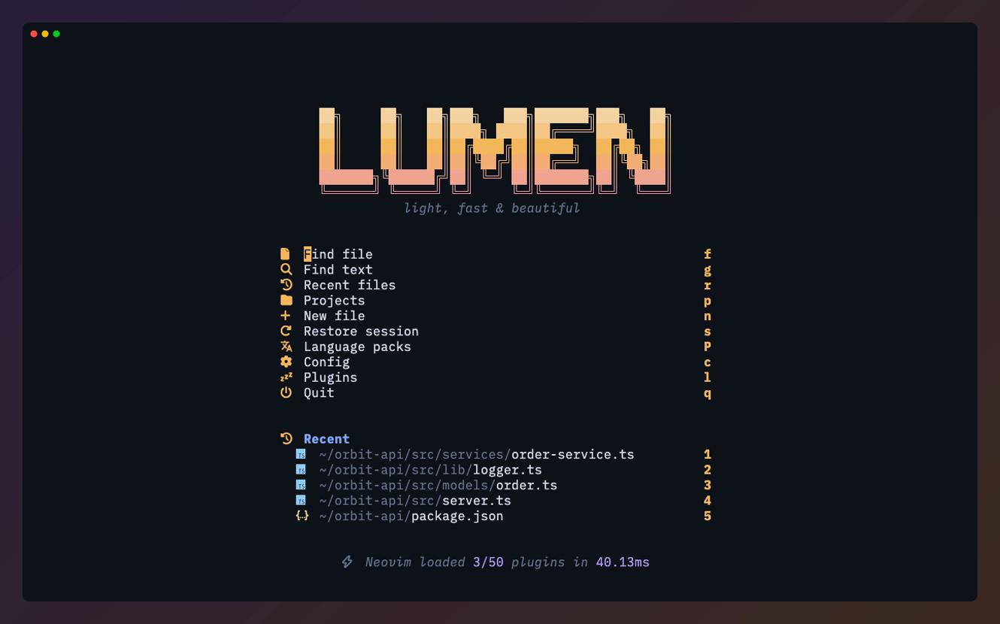
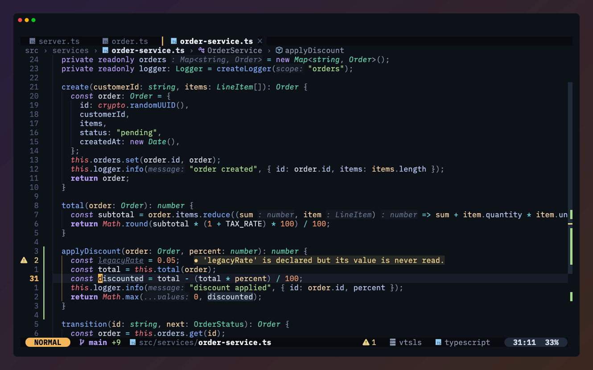
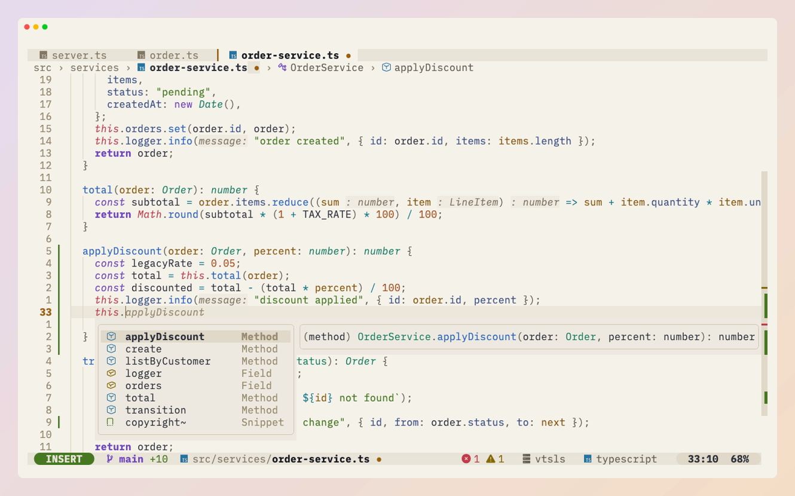
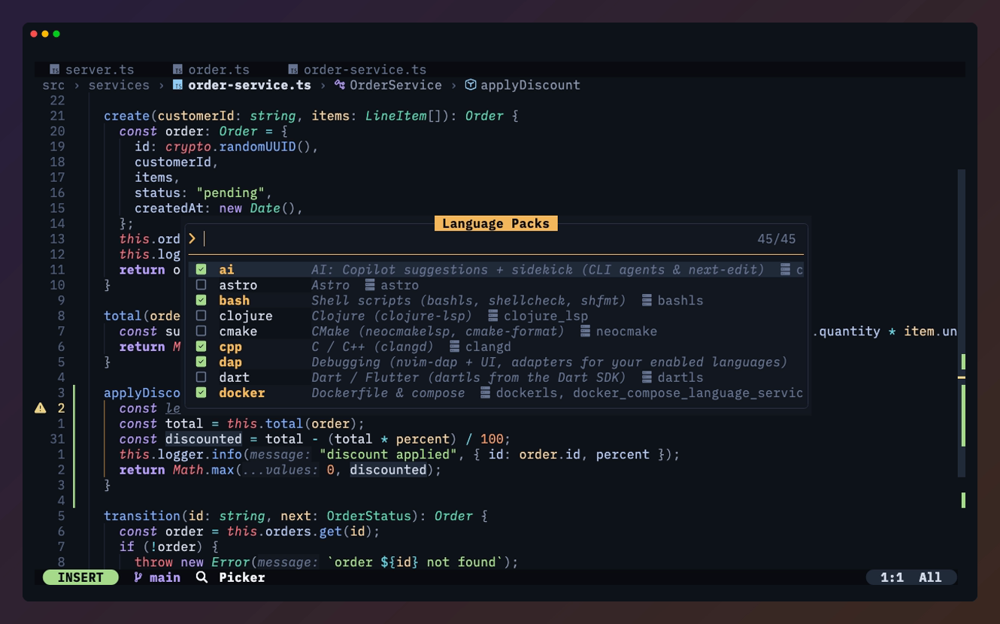
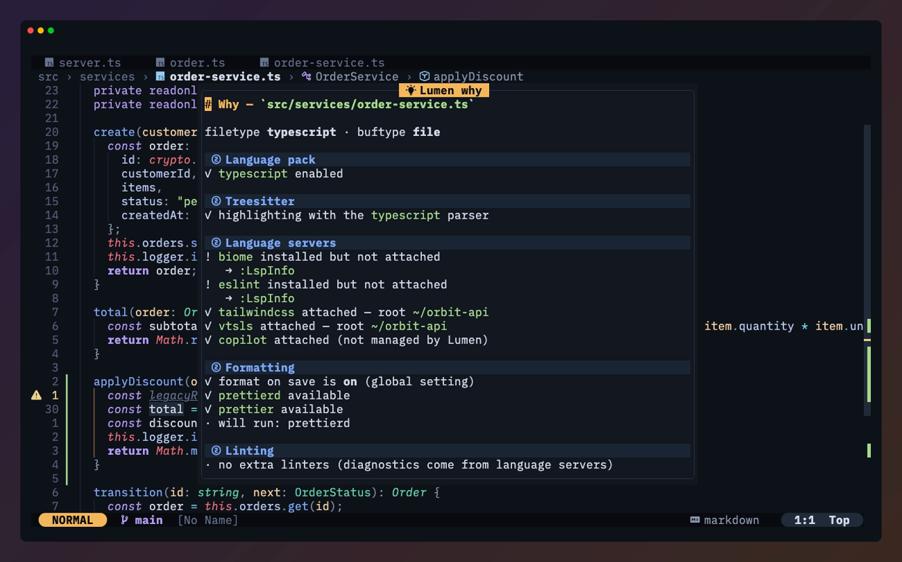
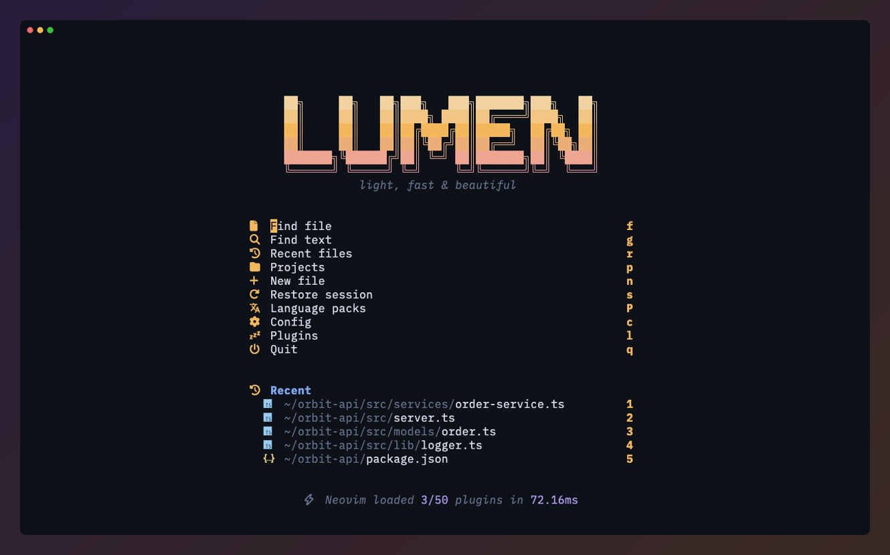

<div align="center">

```
██╗     ██╗   ██╗███╗   ███╗███████╗███╗   ██╗
██║     ██║   ██║████╗ ████║██╔════╝████╗  ██║
██║     ██║   ██║██╔████╔██║█████╗  ██╔██╗ ██║
██║     ██║   ██║██║╚██╔╝██║██╔══╝  ██║╚██╗██║
███████╗╚██████╔╝██║ ╚═╝ ██║███████╗██║ ╚████║
╚══════╝ ╚═════╝ ╚═╝     ╚═╝╚══════╝╚═╝  ╚═══╝
```

### light, fast & beautiful

**A native-first Neovim distribution that starts in 28 ms, looks like one design, and explains itself.**

[](https://github.com/xheisenbugx/lumen/actions/workflows/ci.yml)
[](LICENSE)
[](https://neovim.io)
[](https://github.com/xheisenbugx/lumen/stargazers)

[Install](#install) · [Features](#features) · [Language packs](#language-packs) · [Keymaps](#keymaps) · [Theming](#theming) · [Contributing](#contributing)



</div>

---

Lumen is a Neovim distribution for **Neovim 0.11+ (0.12+ recommended)**. It builds on what
Neovim now ships (`vim.lsp.config`, `vim.lsp.enable`, ui2, `:restart`, `winborder`) instead of
carrying compatibility layers, and it brings its own colorscheme, statusline, tabline, winbar and
scrollbar, so the whole editor speaks one visual language.

You use it the way you use LazyVim. Lumen is a lazy.nvim plugin, and your config dir holds a tiny
starter: about 20 lines of `init.lua`, one settings file, and your own plugins.

## Why Lumen

**It's fast.** Measured on the same machine, median of 15 runs with `--startuptime`:

| scenario | LazyVim (with extras) | **Lumen** |
|---|---:|---:|
| `nvim` → dashboard | 49 ms | **28 ms** |
| `nvim file.lua` (treesitter + LSP + git signs ready) | 155 ms | **80 ms** |

It stays fast once you're working. On a 40,000-line file with 5,000 diagnostics, the statusline
renders in about **30 µs**, the scrollbar in about **80 µs**, and a cursor jump with a full redraw
takes about **1.3 ms**. Performance budgets in the test suite keep it that way.

**It's beautiful.** One palette and one warm accent run through the colorscheme, statusline,
tabline, breadcrumbs, scrollbar and folds. The palette is checked against WCAG contrast in CI.

**It explains itself.** `:Lumen why` tells you which pack, parser, servers, formatters and linters
apply to the current buffer, and gives you the command that fixes each problem it finds.

**It's safe to update.** `:Lumen update` snapshots your plugin versions, updates, checks that
everything still loads in a separate Neovim, and offers to roll back if it doesn't.

**Your config stays yours.** Everything you change lives in your config dir, never inside Lumen,
so updates can't conflict with your edits.

## How it compares

| | LazyVim | AstroNvim | LunarVim | NvChad | **Lumen** |
|---|---|---|---|---|---|
| Actively maintained | ✅ | ✅ | ❌ | ✅ | ✅ |
| Language support | "extras" (code modules) | community packs (separate repo) | built-in | manual | **declarative packs**: one data table per language |
| Offers the right language setup when you open a file | ❌ | ❌ | ❌ | ❌ | ✅ |
| Default colorscheme | tokyonight | astrotheme | lunar | base46 | **lumen-night / lumen-dawn**, built alongside the UI |
| Statusline | lualine | heirline | lualine | custom | **custom, zero-dependency** |
| Cmdline / messages | noice.nvim | native | native | native | **Neovim's ui2** (`cmdheight=0`, no noice) |
| tmux pane navigation | add a plugin | add a plugin | add a plugin | add a plugin | **built in** |

## Features



### A UI with one design language, and no UI dependencies

- **Statusline.** A mode pill, git branch and diff counts, file icon and path, diagnostics, an LSP
  progress spinner, macro recording, search count, task status and position, on one global line.
- **Tabline.** It lists buffers with file icons and marks the active one with a bar. Duplicate
  filenames get their parent folder added, mouse clicks work (middle-click closes), the active
  buffer always stays visible, and tabpages show on the right.
- **Breadcrumb winbar.** Every split shows `dir › file › Class › method`, built from native LSP
  document symbols and cached per buffer. Click a crumb to jump to it.
- **Scrollbar.** A one-column bar on the right edge shows where you are, with marks for errors,
  warnings, git changes, search matches and cursors. Short files don't get one.
- **Pretty folds.** A folded line keeps its syntax highlighting and shows a `⋯ 23 lines` badge.
- **Dashboard.** The logo in a gradient, quick actions, recent files and startup time.
- **ui2.** Neovim's new message and cmdline UI, for a clean `cmdheight=0` look without noice.

### The colorscheme



**lumen-night** is ink-dark surfaces with a single warm amber glow for focus: the cursor line
number, the active tab, picker titles and matches. **lumen-dawn** is its light counterpart. Both
follow `'background'`, so `<leader>ub` flips between them. The scheme covers treesitter, LSP
semantic tokens, diagnostics and every bundled plugin.

Every text color in both variants clears a 4.5:1 contrast ratio against the background (comments
3.5:1, gutter 2.5:1), and the test suite fails if one ever drops below.

**Catppuccin is included** in all four flavours, lazy-loaded so it adds nothing to startup.
**Any other colorscheme works too:** Lumen's statusline, tabline, winbar and folds restyle
themselves from whatever scheme is active.

### Language support that asks before it guesses



Each language is a **pack**: one small data file listing parsers, servers, formatters, linters and
any extra plugins. Open a file whose language you haven't enabled and Lumen offers the matching
pack. Toggle packs in an interactive picker with `:Lumen packs`. See [Language packs](#language-packs).

- **Native LSP** through `vim.lsp.config` / `vim.lsp.enable`, with inlay hints, LSP folding when the
  server supports it, reference highlights and per-server keymaps. Missing servers install through
  Mason after startup and attach to buffers that are already open.
- **Treesitter** on the `main` branch. Missing parsers install in the background, and buffers get
  highlighting once they're ready.
- **Formatting and linting.** conform.nvim formats on save, with global and per-buffer toggles.
  nvim-lint only runs linters that are installed.
- **Completion** from blink.cmp: a Rust fuzzy matcher, ghost text, signature help and cmdline
  completion.

### `:Lumen why`



`<leader>cw` opens a report for the current buffer: which pack, parser, language servers
(attached or not, and why), formatters, linters and project root apply. Every problem comes with
the command that fixes it.

### Task runner

`<leader>rt` finds your project's tasks on its own: package.json scripts (npm, pnpm, yarn or bun,
picked from your lockfile), deno, Makefile, justfile, cargo, go, uv/pytest, composer, mix, gradle,
maven, dotnet, zig, cmake and docker compose. In a monorepo it uses the manifest nearest to your
file.

Run a task in a terminal split, or press `<C-q>` to run it in the background: a spinner shows in
the statusline and errors land in quickfix. `<leader>rr` re-runs the last task for the project.
Add your own with `tasks = {}`.

### Safe updates

`:Lumen update` snapshots `lazy-lock.json`, updates plugins and parsers, then verifies that
everything still loads in a separate, clean Neovim. If something broke, it offers to roll back.
`:Lumen rollback` restores any of the last 15 snapshots. Plain `:Lazy update` works too.

### And the rest

- **Picker and explorer** from snacks.nvim: frecency-ranked files, grep, LSP, git, undo and more.
  Press `<a-c>` in any picker to switch between the project root and the cwd.
- **Native multicursor (Neovim 0.13+).** Lumen styles Neovim's built-in `Q` cursors, shows an
  `N cursors` counter in the statusline, and adds `<leader>mw` to put a cursor on every match of
  the word or selection.
- **tmux navigation built in.** `<C-h/j/k/l>` moves between windows, then on to tmux panes.
- **Diagnostics your way.** `<leader>uv` cycles between virtual text, virtual lines for the current
  line only, and signs only.
- **Project root detection.** LSP workspace first, then root markers, then the cwd, cached per buffer.
- **Familiar editing tools:** flash, mini.surround, mini.ai, mini.pairs, oil, gitsigns, trouble,
  todo-comments, persistence sessions and which-key.

<details>
<summary><b>Watch the tour</b></summary>
<br>



</details>

## Install

**Requirements:** Neovim ≥ 0.11 (0.12+ recommended), `git`, `rg`, a C compiler, the
[`tree-sitter` CLI](https://github.com/tree-sitter/tree-sitter), and a [Nerd Font](https://www.nerdfonts.com).
Optional: `fd`, `lazygit`, `node`.

```sh
# one-liner (backs up any existing ~/.config/nvim to ~/.config/nvim.bak-<timestamp>)
curl -fsSL https://raw.githubusercontent.com/xheisenbugx/lumen/main/install.sh | bash
```

Want to try it without touching your current setup? Install it side by side:

```sh
curl -fsSL https://raw.githubusercontent.com/xheisenbugx/lumen/main/install.sh | bash -s -- --appname lumen
NVIM_APPNAME=lumen nvim
```

The first launch installs plugins, parsers and servers. After that, run `:checkhealth lumen`.

| flag | what it does |
|---|---|
| `--appname <name>` | install to `~/.config/<name>` and run it with `NVIM_APPNAME=<name> nvim` |
| `--fresh` | also back up the app's data, state and cache dirs, for a clean switch from another distro |
| `--repo owner/name` | load Lumen from a fork |
| `--dev` | load Lumen from the local checkout the script lives in (for contributors) |

The installer never deletes anything. Existing directories are moved to `<dir>.bak-<timestamp>`.

<details>
<summary><b>Manual install (LazyVim-style)</b></summary>
<br>

Bootstrap lazy.nvim as usual, then point it at Lumen and your own plugins. This is the core of
the starter's `init.lua`:

```lua
require("lazy").setup({
  spec = {
    { "xheisenbugx/lumen", name = "lumen", import = "lumen.plugins" },
    { import = "plugins" },
  },
})
```

Copy [`starter/`](starter) for the full file, settings template and plugin example.

</details>

## Your config is tiny

```
~/.config/nvim/
├── init.lua               bootstrap: lazy.nvim + Lumen (≈20 lines, rarely touched)
├── lazy-lock.json         your plugin versions
└── lua/
    ├── config/lumen.lua   settings: theme, accent, packs, toggles
    └── plugins/           your extra plugins & overrides
```

Lumen itself lives with your other plugins and updates through lazy.nvim.

## Configuration

| file | what goes there |
|---|---|
| `lua/config/lumen.lua` | Lumen settings. Every key is optional. |
| `lua/plugins/*.lua` | lazy.nvim specs. Add plugins, override Lumen's (`opts` are deep-merged), or disable one with `enabled = false`. |
| `lua/config/options.lua` | Vim options, loaded right after Lumen's (LazyVim convention). |
| `lua/config/keymaps.lua` · `autocmds.lua` | Your mappings and autocmds, loaded after Lumen's so yours win. |

A typical `lua/config/lumen.lua`:

```lua
return {
  colorscheme = "lumen",   -- "lumen-night", "lumen-dawn", "catppuccin", or any installed scheme
  accent = "amber",        -- amber orange red rose violet blue sky cyan teal green yellow, or "#rrggbb"
  packs = { "lua", "json", "yaml", "toml", "markdown", "bash" },

  format_on_save = true,
  winbar = true,           -- breadcrumbs per window
  scrollbar = true,        -- right-edge bar with diagnostic / git / search marks
  diagnostics = "text",    -- "text" | "lines" | "signs"  (cycle live with <leader>uv)
  tmux_navigation = true,

  tasks = { { name = "deploy", cmd = "./scripts/deploy.sh" } },
}
```

<details>
<summary><b>All settings and defaults</b></summary>
<br>

| key | default | |
|---|---|---|
| `colorscheme` | `"lumen"` | `"lumen"` follows `'background'`; pin `"lumen-night"` / `"lumen-dawn"`, or use any scheme |
| `transparent` | `false` | transparent background |
| `italics` | `true` | italic comments and keywords |
| `accent` | `"amber"` | the focus glow: a palette name or `"#rrggbb"` |
| `colors` | `{}` | palette overrides per variant, e.g. `{ night = { bg = "#000000" } }` |
| `on_highlights` | `nil` | `function(hl, palette)` to tweak any highlight |
| `winbar` | `true` | per-window breadcrumbs from LSP symbols |
| `scrollbar` | `true` | right-edge scrollbar with diagnostic / git / search / cursor marks |
| `tasks` | `{}` | extra tasks: `{ { name = "deploy", cmd = "./deploy.sh", cwd = "?" } }` |
| `diagnostics` | `"text"` | `"text"` \| `"lines"` (current line) \| `"signs"` |
| `packs` | `{ "lua", "json", "yaml", "toml", "markdown", "bash" }` | language packs to enable |
| `suggest_packs` | `true` | offer a pack when you open a filetype it supports |
| `auto_install_parsers` | `true` | install missing treesitter parsers on demand |
| `format_on_save` | `true` | |
| `inlay_hints` | `true` | |
| `statusline` | `true` | Lumen's statusline |
| `tabline` | `true` | Lumen's tabline |
| `ui2` | `true` | Neovim's message/cmdline UI (0.12+), `cmdheight=0` |
| `smooth_scroll` | `true` | |
| `leader` / `localleader` | `" "` / `"\\"` | |
| `tmux_navigation` | `true` | `<C-h/j/k/l>` continues into tmux panes |

The source of truth is [`lua/lumen/config.lua`](lua/lumen/config.lua).

</details>

Settings other than `packs` can also be passed as spec opts, from any file in `lua/plugins/`:

```lua
return {
  { "lumen", opts = { accent = "violet" } },
  { "folke/snacks.nvim", opts = { scroll = { enabled = false } } }, -- tweak a bundled plugin
  { "stevearc/oil.nvim", enabled = false },                         -- or turn one off
}
```

## Language packs

A pack is one file that lists what a language needs:

```lua
-- lua/lumen/packs/python.lua
return {
  ft = { "python" },
  parsers = { "python" },
  servers = { basedpyright = {}, ruff = {} },
  formatters = { python = { "ruff_organize_imports", "ruff_format" } },
}
```

There are **46 packs**, and all of them are optional. Only `lua`, `json`, `yaml`, `toml`, `markdown` and `bash` are on by default:

| group | packs |
|---|---|
| Languages | `bash` `clojure` `cmake` `cpp` `dart` `dotnet` (C#/F#) `elixir` `gleam` `go` `graphql` `haskell` `java` `kotlin` `lua` `nix` `ocaml` `php` `prisma` `proto` `python` `ruby` `rust` `scala` `sql` (with the [sqmeow](https://github.com/2giosangmitom/sqmeow.nvim) database client) `swift` `typescript` `zig` |
| Web | `web` (html/css/tailwind) `vue` `svelte` `astro` |
| Docs & notes | `markdown` `org` ([org.nvim](https://github.com/xheisenbugx/org.nvim): Emacs Org mode with agenda, capture and clocking) `tex` `typst` `json` `yaml` `toml` |
| Infrastructure | `docker` `helm` `terraform` |
| Tools | `ai` (Copilot + sidekick) `dap` (debugging) `test` (neotest) `git` (GitHub issues & PRs via octo) `yazi` |

`dap` and `test` read your other packs. Enabling `python` plus `dap` installs debugpy, and
enabling `typescript` plus `test` sets up the jest and vitest adapters.

Four ways to enable a pack:

- `:Lumen packs` opens the picker. Press enter to toggle, then restart when asked.
- `:Lumen packs enable rust` from the command line.
- Add it to `packs = {}` in `lua/config/lumen.lua`.
- Open a file of that type and accept Lumen's offer.

To write your own, drop a file in `lua/lumen/packs/` and it shows up in the list. The test suite
checks that every pack is well-formed and that every parser, server, Mason package, formatter and
linter it references actually resolves.

## Keymaps

`<leader>` is space. Press it and wait, and which-key lists everything. The layout is close to
LazyVim's, so your muscle memory carries over.

| key | action | key | action |
|---|---|---|---|
| `<leader><space>` | smart file finder | `<leader>/` | grep (root) |
| `<leader>,` | buffers | `<leader>e` | explorer |
| `gd` `gr` `gI` `gy` | definition / refs / impl / type | `K` / `gK` | hover / signature |
| `<leader>ca` / `cr` / `cf` | code action / rename / format | `<leader>cw` | why? (buffer setup report) |
| `<leader>rt` / `rr` | pick task / re-run last | `<leader>gg` | lazygit |
| `s` / `S` | flash jump / treesitter | `<C-h/j/k/l>` | windows, then tmux panes |
| `<leader>uC` | colorschemes (live preview) | `<leader>ub` | night / dawn |
| `<leader>uv` | cycle diagnostics display | `<leader>mw` | cursors on every match |
| `<C-/>` | terminal | `<leader>L` | Lumen menu |

<details>
<summary><b>All keymaps</b></summary>
<br>

**Find & search**

| key | action | key | action |
|---|---|---|---|
| `<leader><space>` | files (smart) | `<leader>/` | grep (root) |
| `<leader>,` | buffers | `<leader>:` | command history |
| `<leader>e` / `E` | explorer (root / cwd) | `-` | oil (edit dir as buffer) |
| `<leader>ff` / `fF` | files (root / cwd) | `<leader>fg` | git files |
| `<leader>fr` / `fR` | recent (all / cwd) | `<leader>fb` | buffers |
| `<leader>fc` | config files | `<leader>fp` | projects |
| `<leader>fn` | new file | `<leader>.` / `S` | scratch buffer / select scratch |
| `<leader>sg` / `sG` | grep (root / cwd) | `<leader>sw` | word / selection |
| `<leader>sb` / `sB` | buffer lines / grep open buffers | `<leader>sr` | search & replace |
| `<leader>ss` / `sS` | symbols / workspace symbols | `<leader>sd` / `sD` | diagnostics / buffer diagnostics |
| `<leader>sh` / `sH` | help / highlights | `<leader>sk` | keymaps |
| `<leader>sj` / `sm` | jumps / marks | `<leader>su` | undo history |
| `<leader>sq` / `sl` | quickfix / location list | `<leader>sR` | resume last picker |
| `<leader>st` | todos | `<leader>sp` | plugin specs |

**Code & LSP**

| key | action | key | action |
|---|---|---|---|
| `gd` / `gD` | definition / declaration | `gr` | references |
| `gI` / `gy` | implementation / type definition | `gai` / `gao` | incoming / outgoing calls |
| `K` / `gK` | hover / signature help | `<C-k>` (insert) | signature help |
| `<leader>ca` | code action | `<leader>cr` | rename symbol |
| `<leader>cf` | format | `<leader>cR` | rename file (LSP-aware) |
| `<leader>cc` | run codelens | `<leader>cl` | LSP info |
| `<leader>cd` | line diagnostics | `<leader>cw` | why? (buffer setup report) |
| `<leader>cs` / `cS` | symbols outline / LSP refs (Trouble) | `<leader>cm` | Mason |
| `]d` `[d` | next / prev diagnostic | `]e` `[e` / `]w` `[w` | errors / warnings |
| `<leader>xx` / `xX` | diagnostics / buffer diagnostics (Trouble) | `<leader>xQ` / `xL` | quickfix / location list (Trouble) |

**Git**

| key | action | key | action |
|---|---|---|---|
| `<leader>gg` | lazygit | `<leader>gs` | status |
| `<leader>gl` / `gL` | log / line history | `<leader>gf` | file history |
| `<leader>gb` | branches | `<leader>gB` | open in browser |
| `<leader>gd` | diff (hunks) | `<leader>gS` | stash |
| `]h` `[h` | next / prev hunk | `<leader>gh*` | hunk actions |

**Tasks, editing & multicursor**

| key | action | key | action |
|---|---|---|---|
| `<leader>rt` | run task | `<leader>rr` / `rq` | re-run last / re-run into quickfix |
| `s` / `S` | flash / flash treesitter | `gsa` `gsd` `gsr` | add / delete / replace surrounding |
| `<A-j>` / `<A-k>` | move line(s) | `gco` / `gcO` | add comment below / above |
| `<C-s>` | save | `<esc>` | escape & clear search |
| `Q` / `<leader>ma` | toggle cursor here | `<leader>mw` | cursors on every match |
| `<leader>mc` / `mr` | clear / restore cursors | `<leader>mf` | toggle follow mode |

**Toggles (`<leader>u`)**

| key | toggle | key | toggle |
|---|---|---|---|
| `uf` / `uF` | format on save (global / buffer) | `ub` | dark background (night / dawn) |
| `uw` | wrap | `us` | spelling |
| `ul` / `uL` | line numbers / relative | `ud` | diagnostics |
| `uv` | diagnostics display | `uh` | inlay hints |
| `uT` | treesitter | `ug` | indent guides |
| `uc` | conceal | `uS` | smooth scroll |
| `uD` | dim | `uz` / `uZ` | zen / zoom |
| `uC` | colorschemes | `un` | dismiss notifications |

**Windows, buffers, tabs & sessions**

| key | action | key | action |
|---|---|---|---|
| `<C-h/j/k/l>` | windows, then tmux panes | `<C-arrows>` | resize |
| `<leader>-` / `\|` | split below / right | `<leader>wd` | close window |
| `<S-h>` `<S-l>` / `[b` `]b` | prev / next buffer | `<leader>bb` | alternate buffer |
| `<leader>bd` / `bo` / `bD` | delete / others / buffer & window | `<leader><tab>*` | tab pages |
| `<leader>qs` / `ql` / `qS` | restore / last / select session | `<leader>qd` | don't save session |
| `<leader>qr` | restart Neovim (0.12+) | `<leader>qq` | quit all |
| `<C-/>` | terminal | `<leader>l` / `L` | Lazy / Lumen menu |

**Packs:** `dap` adds `<leader>d*` and `F5` `F10` `F11`, `test` adds `<leader>t*`, `ai` adds
`<leader>a*`, `git` adds Octo issues / PRs / review, `yazi` adds `<leader>y` / `Y`, `sql` adds the
`<leader>D*` database keys (drawer, connections, scratchpads, query history), and `org` brings
org.nvim's own `<leader>o*` keys (agenda, capture, clocking).

Search everything live with `<leader>sk` or `:Lumen keys`.

</details>

## Commands

| command | |
|---|---|
| `:Lumen` | menu |
| `:Lumen packs [enable\|disable <name>]` | manage language packs |
| `:Lumen why` | explain this buffer's LSP / format / lint / parser setup |
| `:Lumen tasks` | run a project task |
| `:Lumen update` | snapshot → update → verify → offer rollback |
| `:Lumen rollback` | restore plugins from a snapshot |
| `:Lumen theme` | toggle night / dawn |
| `:Lumen config` | edit your config |
| `:Lumen keys` | search all keymaps |
| `:Lumen profile` | startup profile |
| `:Lumen health` | `:checkhealth lumen` |

## Theming

**Pick an accent.** One setting recolors every point of focus across the UI:

```lua
accent = "violet", -- amber orange red rose violet blue sky cyan teal green yellow, or "#rrggbb"
```

**Override the palette** per variant, or **tweak any highlight**:

```lua
colors = { night = { bg = "#0b0d12" } },
on_highlights = function(hl, p)
  hl.Comment = { fg = p.teal, italic = true }
end,
```

**Use Catppuccin.** Set `colorscheme = "catppuccin"` (latte or mocha, following `'background'`),
or pin `catppuccin-latte`, `-frappe`, `-macchiato` or `-mocha`. Its plugin integrations are
detected automatically.

**Use anything else.** Install any colorscheme and select it. Lumen maps Catppuccin exactly and
derives colors for every other scheme, so the statusline, tabline, winbar and folds always match.
`accent` still applies if you set it. Browse them all with live preview in `<leader>uC`.

## Performance

The numbers at the top come from a single machine, `--startuptime`, median of 15 runs, against
LazyVim with extras. Measure on your own machine:

```sh
./scripts/bench.sh 15   # median startup over N runs (default 10)
```

or run `:Lumen profile` inside the editor.

The headless test suite also holds the UI to budgets on a 20,000-line buffer with 3,000
diagnostics (statusline and tabline under 150 µs, scrollbar under 1 ms), so a slow change fails
CI instead of reaching you.

## Contributing

Contributions are welcome. Read [AGENTS.md](AGENTS.md) for the project's conventions, then:

```sh
git clone https://github.com/xheisenbugx/lumen && cd lumen
./install.sh --dev --appname lumen-dev   # run Lumen from your checkout
./scripts/test.sh                        # headless smoke suite in an isolated sandbox
./scripts/bench.sh                       # startup benchmark
stylua .                                 # format
```

`scripts/test.sh` runs the real starter, loading Lumen from your checkout, in a sandbox under
`.tests/` (the first run installs everything). It covers the colorscheme and both variants,
accent and `on_highlights`, Catppuccin adaptation, the statusline, tabline, winbar, scrollbar and
folds, LSP attach, task discovery, `:Lumen why`, update verification, pack integrity, performance
budgets, WCAG contrast, and a clean startup with no errors. CI runs it on Neovim stable and
nightly, plus a `stylua --check`.

<details>
<summary><b>Repository layout</b></summary>
<br>

```
lua/lumen/
  plugins/init.lua       first spec lazy.nvim reads: settings, options, LazyFile, the `lumen` plugin
  plugins/*.lua          core plugin specs (+ packs.lua: specs for enabled packs)
  init.lua               init() at spec time · setup() as the plugin's config
  config.lua             defaults, merged with your lua/config/lumen.lua
  options.lua keymaps.lua autocmds.lua commands.lua health.lua
  lsp.lua diagnostics.lua tasks.lua why.lua update.lua
  packs.lua packs/*.lua  language packs
  colors/                palettes, highlight groups, any-colorscheme adapter
  ui/                    statusline, tabline, winbar, scrollbar, folds
  util/                  root detection, helpers (global `Lumen`)
colors/                  :colorscheme lumen | lumen-night | lumen-dawn
starter/                 the template install.sh copies into your config dir
tests/ scripts/          smoke tests + benchmarks (run against the real starter)
```

</details>

## Credits

Lumen stands on the work of people who made Neovim's plugin ecosystem what it is:

- [folke](https://github.com/folke) for [lazy.nvim](https://github.com/folke/lazy.nvim),
  [snacks.nvim](https://github.com/folke/snacks.nvim), [which-key](https://github.com/folke/which-key.nvim),
  [flash](https://github.com/folke/flash.nvim), [trouble](https://github.com/folke/trouble.nvim),
  [todo-comments](https://github.com/folke/todo-comments.nvim), [persistence](https://github.com/folke/persistence.nvim),
  [lazydev](https://github.com/folke/lazydev.nvim), [sidekick](https://github.com/folke/sidekick.nvim),
  and for [LazyVim](https://github.com/LazyVim/LazyVim), whose layout Lumen follows
- [mini.nvim](https://github.com/nvim-mini/mini.nvim) (icons, ai, surround, pairs, hipatterns)
- [blink.cmp](https://github.com/saghen/blink.cmp)
- [nvim-treesitter](https://github.com/nvim-treesitter/nvim-treesitter) and its textobjects
- [conform.nvim](https://github.com/stevearc/conform.nvim) and [oil.nvim](https://github.com/stevearc/oil.nvim)
- [nvim-lint](https://github.com/mfussenegger/nvim-lint) and [nvim-dap](https://github.com/mfussenegger/nvim-dap)
- [mason.nvim](https://github.com/mason-org/mason.nvim), [mason-lspconfig](https://github.com/mason-org/mason-lspconfig.nvim)
  and [nvim-lspconfig](https://github.com/neovim/nvim-lspconfig)
- [gitsigns.nvim](https://github.com/lewis6991/gitsigns.nvim)
- [catppuccin](https://github.com/catppuccin/nvim)
- [neotest](https://github.com/nvim-neotest/neotest), [octo.nvim](https://github.com/pwntester/octo.nvim),
  [yazi.nvim](https://github.com/mikavilpas/yazi.nvim), [sqmeow.nvim](https://github.com/2giosangmitom/sqmeow.nvim),
  [org.nvim](https://github.com/xheisenbugx/org.nvim)
  and the other plugins the packs pull in
- and the [Neovim](https://github.com/neovim/neovim) team, for the built-ins Lumen is designed around

## License

[MIT](LICENSE)
